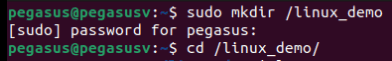
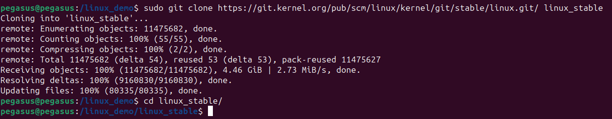
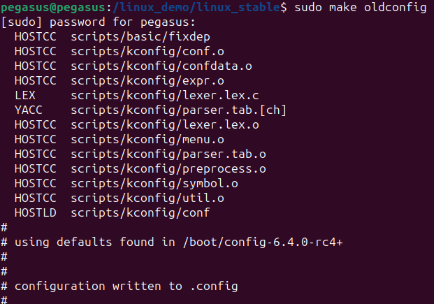
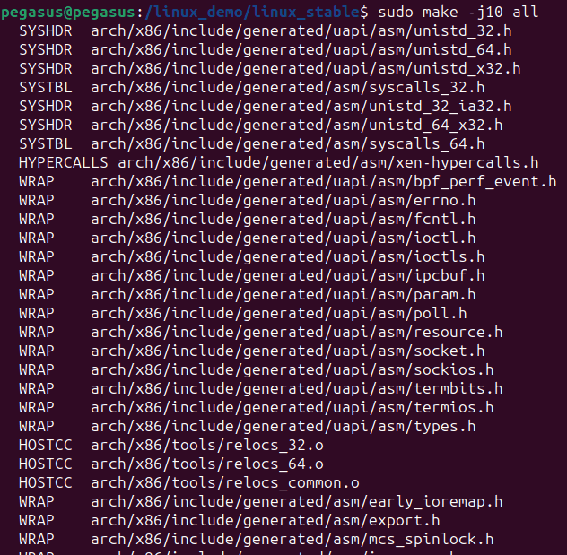
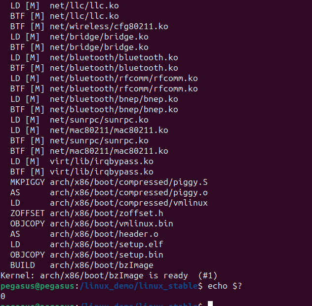
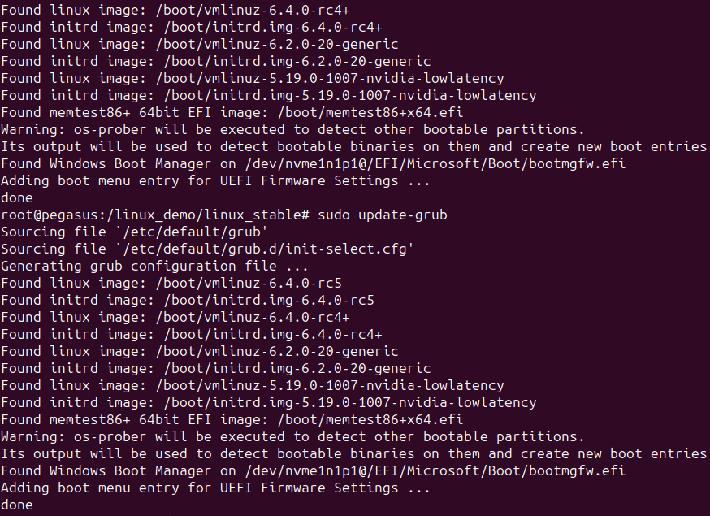
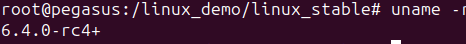
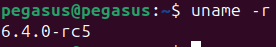

\



আজকে আমরা আলোচনা করব source code থেকে কিভাবে linux kernel compile করা যায় এবং সেই compiled kernel এ কিভাবে boot নেওয়া যায় | প্রথমে একটি **linux_demo** নামে একটি directory বানিয়ে নিলাম | এরপর linux এর stable kernel repository থেকে clone করে নিলাম | এবার আমাদের লিনাক্স configuration file generate করা লাগবে | `make oldconfig` বর্তমানে যেই kernel এ boot নেওয়া তার থেকে .config file নতুন kernel এর জন্যেও copy করে নিয়ে আসে এবং যেসব options পুরাতন kernel এ ছিলো নাহ সেগুলো এর জন্যে user কে option select করতে বলে | আর

```
lsmod > /tmp/my-lsmod
make LSMOD=/tmp/my-lsmod localmodconfig
```

এই command use করে আমরা আমাদের বর্তমান kernel এ loaded module অনুসারে `.config` file তৈরি করতে পারবো | এই `.config` file এর অনুযায়ী ই compilation হয়ে থাকে | `.config` file এ যে যে options enable থাকবে kernel এর final build এও ওগুলোই enable করা থাকবে | এছাড়াও built-in in the kernel অথবা loadable kernel হিসাবে কোন কোন driver থাকবে তাও বলা থাকে এই file এ | এছাড়াও `make menuconfig` দিয়েও .config file generate করা যায় |

\


Compile করা শেষ|এখন আমাদের compiled kernel install করার সময়| `echo $?` আমাদের return value show করে| return value 0 মানে প্রোগ্রামটি successfully run হয়েছে |\


এখন সর্বশেষ আমাদের compiled kernel টি install করার সময় |

```
sudo su
su -c "make modules_install install"
```

এই command টি আমাদের নতুন kernel টিকে install করে ফেলবে | `sudo update-grub` command টি আমাদের নতুন এই মাত্র install করা kernel টিকে grub bootloader এ add করে দিবে অর্থাৎ এখন থেকে আমরা আমাদের নতুন install করা kernel এ boot নিতে পারবো |

\


এখানে দেখতে পাচ্ছি আমার grub update করা শেষ | এখন খালি নতুন আমার built করা kernel এ boot নেওয়ার পালা | \

আমার আগের kernel:



আমার নতুন kernel after reboot:



এখন অনেকেরই মনে প্রশ্ন আসতে পারে এতো কাহিনী করে kernel install করার reason কি? এবং এইযে source থেকে যে কোনো program build করে run করার ব্যাপারটি সব open source project এই থাকে | এটার সুবিধা হচ্ছে আমি software টিকে আমার মতো customize করতে, bug fix করতে, feature impelement করতে পারবো | অর্থাৎ software টির আমার মন মতো customized version এর user হলাম আমি এবং এই customization টি আমি নিজেই codebase change করে করেছি |

---


---

