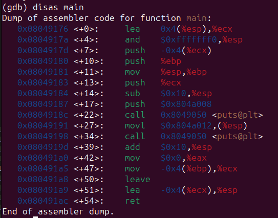
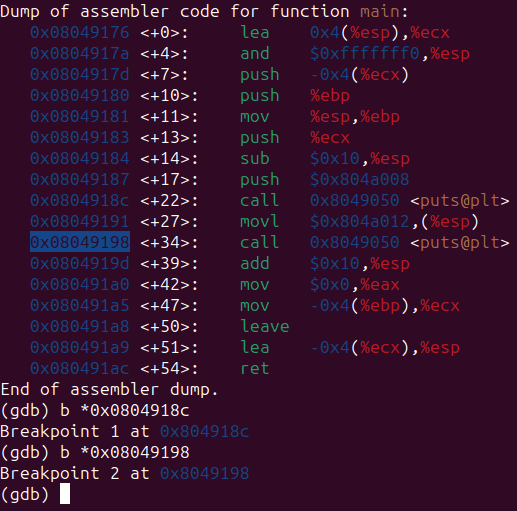
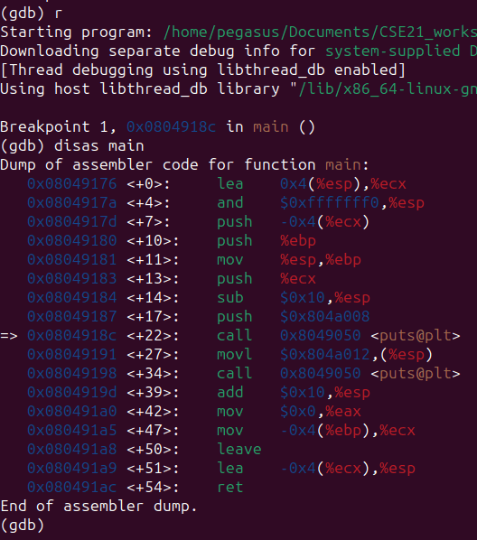
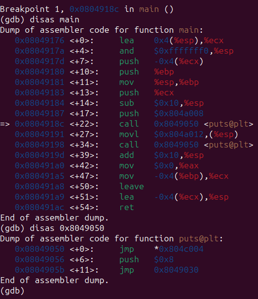
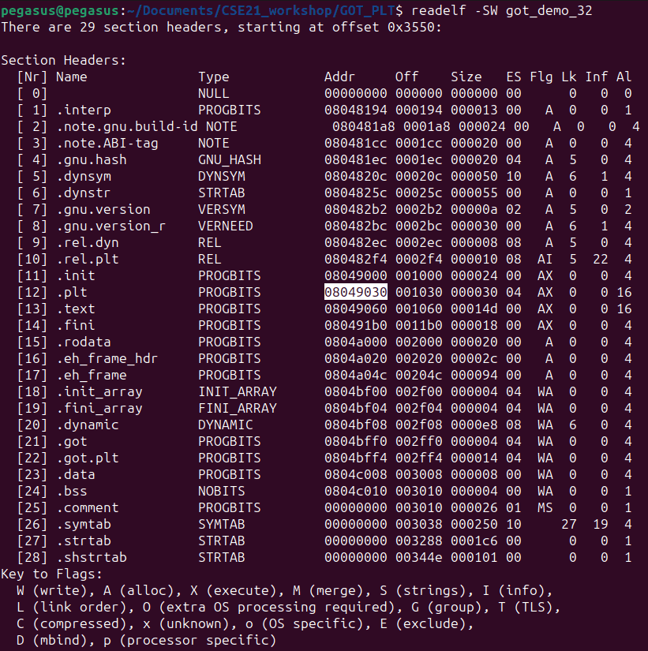
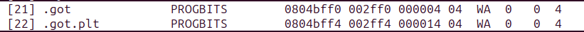
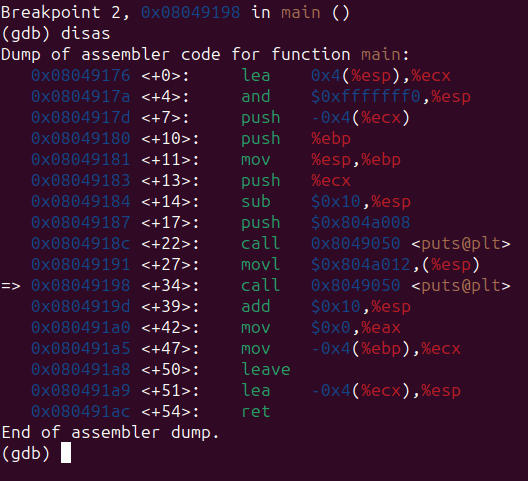
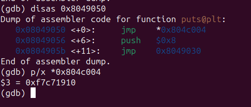
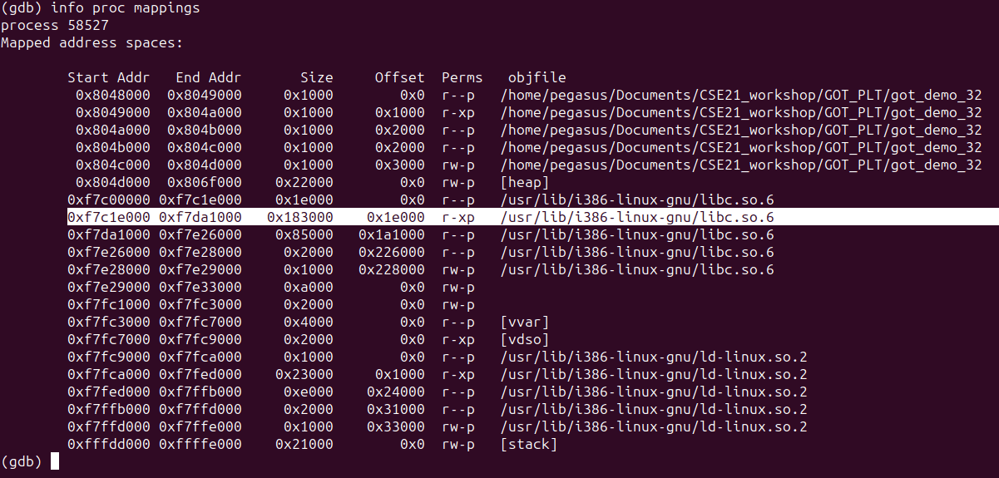

আমরা যখন কোনো সি প্রোগ্রাম লিখি তখন আমরা সাধারণত লাইব্রেরি ফাংশন গুলো নিজে লিখি নাহ| এই ফাংশন গুলো আমাদের লিনাক্স এর থেকে glibc নামক লাইব্রেরি থেকে আসে| এর ভেতরেই আমাদের অতি পরিচিত printf, scanf define করা থাকে| এখন প্রশ্ন হচ্ছে আমরা নরমাল্লি ফাংশন এর definition এবং declaration এর ব্যাপারে জানি| Declaration হচ্ছে ফাংশন এর নাম, তার প্যারামিটার এবং return type. অন্যদিকে definition হচ্ছে ফাংশন body যে ফাংশনটি কি করবে এর ফাংশনালিটি কি আসলে| তো আমাদের কোডে printf, scanf এর declaration থাকলেও (ইহা preprocessor directives তথা `#include <stdio.h>` expand হয়ে যুক্ত হয়) definition কোথাও থাকে নাহ তাও আমাদের কোড কাজ করে ঘটনাটা কি ঘটে তাহলে এখানে? এই ঘটনাটাই হচ্ছে dynamic linking. আমার প্রিন্ট ফাংশন libc তে define করা থাকলেও আমি আরামে use করতে পারছি| এবং এই linking তা হয় runtime এ অর্থাৎ কোড রান হতে থাকা অবস্থায়| এখানে [“lazy binding”] নামের একটা চমৎকার কনসেপ্ট ব্যবহার করা হয়| নিচের সি কোডটি লক্ষ্য করিঃ 

```
#include <stdio.h>

int main(){
        printf("Hello Man\n");
        printf("Hola Gracious\n");
        return 0;
}
```

এখন আমরা একটু কোডটি রান করে ধাপে ধাপে debugging করি| 

এবার breakpoints সেট করি সেই সব লাইগুলোতে যেখানে puts call করা হয়েছে | এখানে compiler এর optimization এর কারণে printf বদলে puts এ পরিণত হয়ে গেছে | এটা নিয়ে আপাততো মাথা না ঘামালেও চলবে | তো আমরা puts যেসব line এ আছে ওগুলোতে breakpoints সেট করি |



এবার run করি | লক্ষ্য রাখি এবারই প্রথম বারেরে মতো puts function টি কল হবে |



আমরা লক্ষ্য করতেসি এই address টি PLT (Procedure Linkage Table) এর একটি অংশ| এবার আমাদের অবজারভেশন আমরা verify করি|



এখানে আমরা section headers



গুলো দেখি আমাদের file এর | আমরা দেখতে পারি PLT `0x08049030` এই address এ শুরু হয়ে `0x804a060` এই address এ শেষ হয়েছে | আবার GOT (Global Offset Table) এর address নিচে দেয়া হলো



PLT address

```
>>> hex(0x8049030+0x001030)
'0x804a060'
```
```
(gdb) p/x *0x804c004
$2 = 0x8049056
```

এখন আমরা PLT এর প্রথম instruction দেখি `0x08049050 <+0>: jmp *0x804c004`. 0x804c004 এই address এ `0x8049056` এই value stored আছে | একটু খেয়াল করলেই আমরা দেখবো **puts@plt** এর দ্বিতীয় লাইনের address ই 0x8049056 | এখন আমরা তৃতীয় লাইনে দেখি `jmp 0x8049030`. মজার ব্যাপার হলো এই address টাই PLT এর শুরু address. এখন সে PLT এর শুরুতে গিয়ে dynamic linker কে runtime এ call করে **puts@plt** এর প্রথম entry `jmp *0x804c004` instruction এর ***0x804c004** এই address এর value কে libc তে থাকা puts function এর address দিয়ে replace করে দিবে| তো চলো ব্যাপারটা verify করি | যেহেতু puts একবার call হয়ে গিয়েছে dynamic linker already GOT তে puts এর address update করে ফেলার কথা |



VOILA! ***0x804c004** এর address already 0xf7c71910 এত দ্বারা replace হয়ে গিয়েছে| যেহেতু 0xf7c71910 address টি libc এর একটা address এবং dynamic linker GOT কে update করে ফেলেছে, এখন এরপর থেকে যতবারই আমরা puts কে call করব সরাসরি libc থেকে puts function টি call হবে এবং এটি আমাদের code এ dynamically linked হয়ে গিয়েছে |


আমরা নিচে দেখতে পারি **0xf7c71910** এই address টি আমাদের pc তে থাকা library function libc.so.6 এর অংশ |



উপরের c code টি compile এবং নিজে, নিজে এই মজার ব্যাপার টি নিয়ে experiment করার জন্যে এইভাবে c code টি কম্পাইল করো|

```
$ gcc -fno-pie -no-pie -Og -m32 got_demo.c -o got_demo_32
$ gdb
$ (gdb) file got_demo_32
```

---

