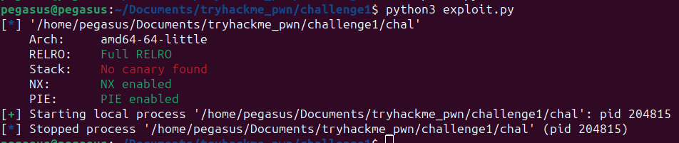
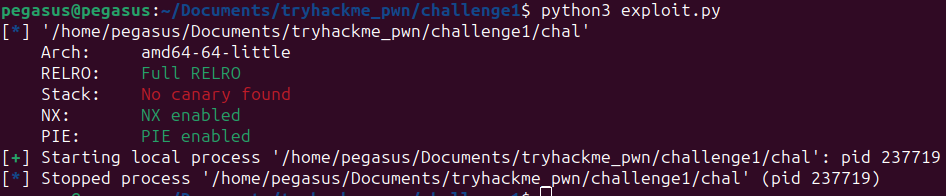
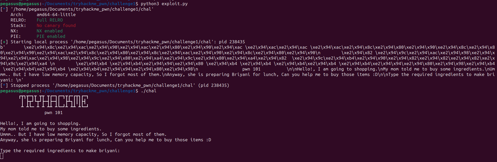
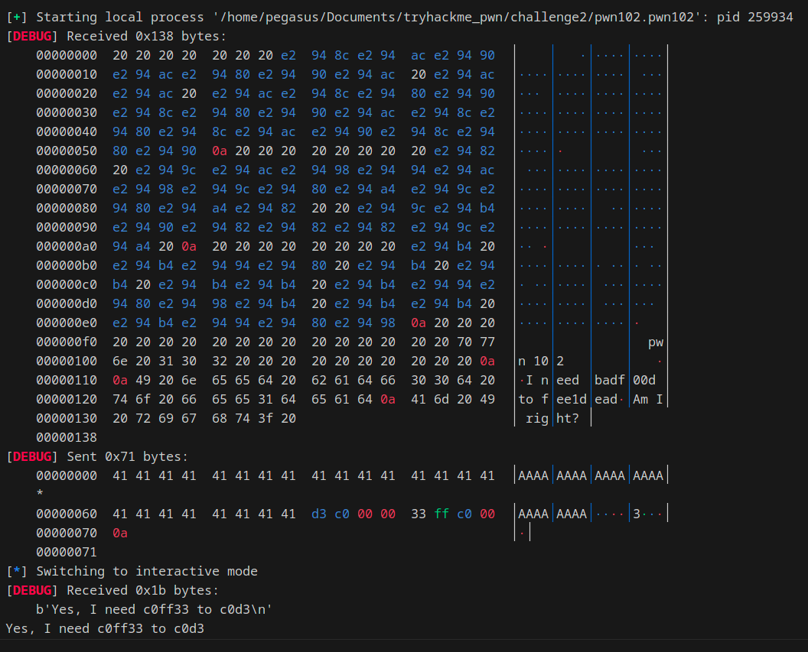

[Pwntools](https://github.com/Gallopsled/pwntools) is a widely used library for writing exploits. At first it might seem intimidating but overtime you will start to realise the power of it. In this blog I'll try to give a walkthrough of pwntools to write exploits. 

--------
### Installation
#### Python3
```
$ apt-get update
$ apt-get install python3 python3-pip python3-dev git libssl-dev libffi-dev build-essential
$ python3 -m pip install --upgrade pip
$ python3 -m pip install --upgrade pwntools
```
The new python 3.11 might scream regarding creating virtual environment and directly copy pasting these instructions might not work. 
You might pass `--break-system-packages` with pip install <span style="color: red;">*Not recommended.</span>Or you might use apt install python3-<package name\> to install python packages system-wide. Do your own research.

#### Python2
```
$ apt-get update
$ apt-get install python python-pip python-dev git libssl-dev libffi-dev build-essential
$ python2 -m pip install --upgrade pip==20.3.4
$ python2 -m pip install --upgrade pwntools
```


-------
### Connecting to a server or process
While writing exploits for CTFs our first target is to connect to a remote server for that the port and ip is given in the challenge.<br/>
So the first command will be:

`
p = remote(<ip>, ,<port>)
`<br/>
For exampe if the given ip is `10.10.95.109` and port is `9000`. We connect to it using <br/>
`p = remote("10.10.95.109", 9000)`<br/>
What happens if we wanna just connect to a local process? We write:<br/>
`p =  process()`<br/>
But here's the catch the pwntools doesn't know which process to connect to. So it will through an error. So what we can do is either: set the context.binary or provide arguement. So we write(if the binary filename is chal):

```
p = process("./chal")

# or
context.binary = "./chal" # setting the context automatically tells pwntools to run that specific binary.
p =  process()

# or we can create an ELF object and attach pwntools to it
context.binary = binary = ELF("./chal")
p = process() or p = binary.process()

```
Current stage exploit:
```
from pwn import *
context.binary = binary = ELF("./chal")
p = process()
```

Okay so setting our context, or connecting to the remote server or attaching to a local process should be done at this moment and we are good to go now. Setting up context.binary or creating ELF object will by default print the checksec results .(Various protections applicable to this binary). 



But wait a minute shouldn't the binary run? And show me output? Where's my output? It just talks about starting and ending the process. So what's actually happening is the binary is running but we aren't receiving the output. So it's not showing up on stdout.
So let's check another functionality of pwntools.

-----------------
### Receiving output

[`p.recv()`](https://docs.pwntools.com/en/stable/tubes.html#pwnlib.tubes.tube.tube.recv) is equivalent to read. <br/> <span style={{ backgroundColor: 'yellow' }}>  &nbsp; recv(numb=4096, timeout=default) → bytes.  </span> &nbsp; Receives up to numb bytes of data from the tube, and returns as soon as any quantity of data is available.

[`p.recvline()`](https://docs.pwntools.com/en/stable/tubes.html#pwnlib.tubes.tube.tube.recvline) is equivalent to readline.<br/><span style={{ backgroundColor: 'yellow' }}>  &nbsp; recvline(keepends=True, timeout=default) → bytes.  </span> &nbsp; Receive a single line from the tube.<br/>
A “line” is any sequence of bytes terminated by the byte sequence set in newline, which defaults to `\n`.

[`p.recvall()`](https://docs.pwntools.com/en/stable/tubes.html#pwnlib.tubes.tube.tube.recvall) is equivalent to readall. <br/><span style={{ backgroundColor: 'yellow' }}>  &nbsp; recvall(timeout=Timeout.forever) → bytes.  </span> &nbsp; Receives data until EOF is reached and closes the tube. Be aware that recvall() sometimes might slow the receiving packets over the network. 

[`p.recvuntil()`](https://docs.pwntools.com/en/stable/tubes.html#pwnlib.tubes.tube.tube.recvuntil) is equivalent to readuntil. <br/><span style={{ backgroundColor: 'yellow' }}>  &nbsp; recvuntil(delims, drop=False, timeout=default) → bytes.  </span> &nbsp; Receive data until one of delims is encountered.

------------------
Enough theory let's add receive to out exploit and see if we get our desired output or not?
```
from pwn import *
context.binary = binary = ELF("./chal")
p = process()
p.recv()
```
O Ow! still the same output...



let's add `print()` to `p.recv()`. So the exploit changes to `print(p.recv())`



Look at the peculiarity of the pwntools. It receives stuffs as bytecode. we could've also used `p.recvuntil(b"briyani: \n")`. Look how I've used extra ` \n` here. With a space and a newline. I could've used `p.recvuntil(b"briyani:")`. But during this case we need to experiment what we are receiving. Sometimes if we use `p.recvuntil(b"briyani:")` we might need to add extra `p.recv()` <br/>
Another thing is, in python3 we need to specifically specify receive and send stuffs as bytes. That's why we are using `b''`. Python2 isn't this strict with bytecodes. But the use of python2 is getting reduced day by day. 

--------

### Sending payload
How let's come to the main alchemy, spell cookbook we are waiting for: ***THE PAYLOAD***. Sending payload has similar functions like receiving functions. Like `send(), sendline(), sendafter()`. The only difference between send and sendline is a `\n`. The newline works as pressing enter on keyboard.
```
p.send(payload)
# or
p.sendline(payload)
# or
p.sendafter(payload)
```

--------

### Writing payload
Our computers by default uses little-endian format. So if we have a function **main** and it's address is `0x555555400992` in little endian format it will be: `\x92\x09\x40\x55\x55\x55` but it is 6 bytes. But our modern machines are 64bits. That means 8 bytes. So after padding it will be `\x92\x09\x40\x55\x55\x55\x00\x00`. `p64()` does exactly this for us. We can also pack as big endian using `endian='big'` parameter in packing functions. If the binary is 32 bits, then we use `p32()`. It converts the address to 32 bits/4 bytes. the p32(), p64() use `struct.pack()` function underneath. And any characters or strings we use we need to use it as bytecode e.g. `payload = b"A"*40 + p64(main_address)`.

--------

### Unpacking and formating received bytes
In some exploits we need to leak addresses from the binary. After leaking the addresses We use `u64(), u32()` functions. And the `strip()`, `split()`, `ljust()` functions are also useful for formating the leaked addresses properly. 

1. Sometimes we get leaked address as hexadeciaml (as string). Then we need to make it integer. E.g. `canary = int(output.split(b".")[1].strip(),16)` Here we were getting the output as: `b'AFE87E4AFE915400'`. Then we convert it to integer: `12675520011797877760`. We needed to do this because `p64()` accepts non string value. 

2. If we are getting the address leaked as byte code, we need to pad it to get 8 bytes and then unpack it to convert it to interger as we already know that `p64()` accepts non strings(hex, int) and not bytecode. E.g. `puts_address = u64(output[0].ljust(8, b"\x00"))`

3. Sometimes the leaked address is in ASCII format. We need to retrieve flag from the leaked address. So converting the ASCII value to string is important. E.g. `flag += bytes.fromhex(word.decode("utf-8"))[::-1].decode("utf-8")` 

--------

### Getting GOT, PLT, Symbols elements from binary
Another great utility pwntools offer is getting functions from different sections of a binary. The symbol table contains information about the symbols defined in the binary object file, such as function and variable names, their types, and their addresses. For example:

```
binary.symbols.puts
binary.got.puts
binary.plt.puts
```
In basic exploitations `binary.symbols.<function name>` will come handy. And in advanced exploits `binary.got.<function name>`, `binary.plt.<function name>` comes in handy. **Remember while adding the addresses to the payload we need to pack it. E.g. `p64(binary.symbols.puts)`**

----------

### Interacting with the process manually

Using &nbsp; `p.interactive()` &nbsp; we can interact with the process just like we do in a typical terminal.

----------

### Debugging

We can debug our exploit in multiple ways. One easy way is to set log_level.<br/>
`context.log_level = "debug"`
When we set our log level to debug we can check the bytes we are sending and receiving over the network.



Another way to debug exploits is using `gdb.attach()` or `gdb.debug()`. It will open a gdb in a new terminal with the process attached.

Attach needs a running process.
```
p = process("./chal)
gdb.attach(p)
```

Debug just uses the binary.
```
gdb.debug("./chal")
```

If your new terminal window is not opening you need to set `context.terminal` to appropiate terminal environment. Try is from outside of vscode. The `gdb.attach()` functions don't work for remote objects outside local machine. **So you can't use**
```
p = remote(ip, port)
gdb.attach(p)
```
----------

### ROPChain

Normally we use ROPgadget to find the gadgets within the binary.
But pwntools also provides way to create ROPChain. Using the ROP object we will be able to discover different gadgets from the binary. `find_gadget()` returns a list where the first element is the address of the gadget. 

```
binary = ELF("./chal")
rop = ROP(binary)
ret = rop.find_gadget(["ret"])[0] 
```
We can also use ROP object to call functions. E.g.
```
rop.call("puts", [elf.got['puts']])
rop.call("vuln")
```
Checkout other cool ROP methods [here](https://docs.pwntools.com/en/stable/rop.html).

----------

### Searching strings

Pwntools can be used to find strings from an ELF Object. `libc.search()` returns an object that's why using `next()` to find the adddress of the string.

```
libc = ELF("./libc6_2.27-3ubuntu1.4_amd64.so")
bin_sh = next(libc.search(b"/bin/sh\x00"))`
```
----------

### Shellcraft
Pwntools also supports shellcraft. This is the feature that I barely use. I normally search exploit-db, shell-strom for shellcodes. But using shellcraft we can also get shellcodes:<br/>
`paylaod += asm(shellcraft.execve(path="/bin/sh", argv=["/bin/sh"]))`<br/>
`payload += asm(shellcraft.sh())`<br/>
Architecture wise we can get many other shellcodes like: &nbsp;` shellcraft.mips.read(0, 0xffffeeb0, 20)`. Since I don't use it much I'm not so good at it. Do your research.

----------

### Some tips
Any context setting should be done at the top of the code. And `p.interactive()` should be at the end of the code.

----------

Since I'm also learning and sharing my knowledge. Please send me corrections or suggestions. It might help me in my journey too! Good Luck fellow pwner!