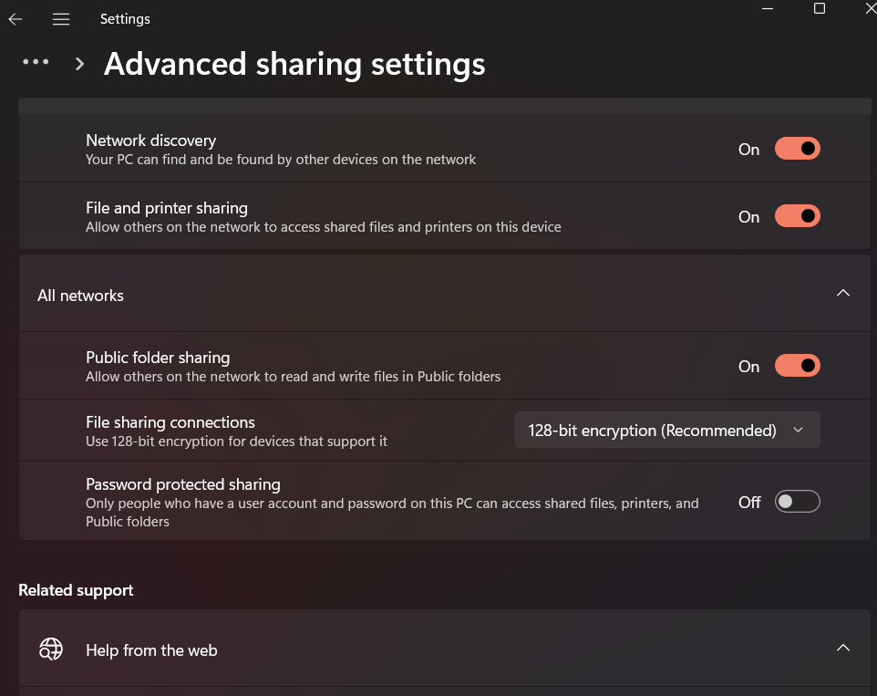
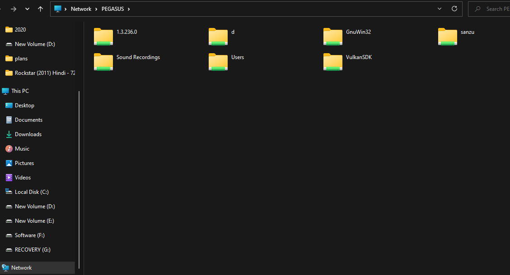
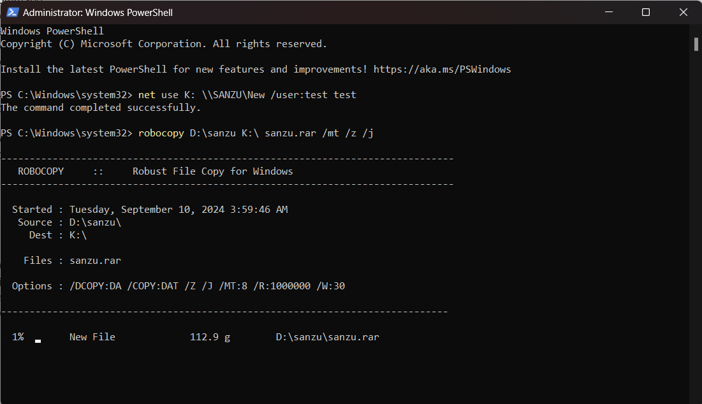

Today I'm gonna discuss about file transfer. If you don't have external ssd or hdd, transferring larger files can be hectic (specially when both the pcs are windows pcs)
.I'm going to share some of the tactics that might help you lessen the hastle.

### Using Python http server

First install python on the pc you want to share the files from,
[Python downloads](https://www.python.org/downloads/). 
Go to the directory where the folder/file you want to share folder/file resides. Now open the powershell in the respective drive or navigate to that directory. Now use the following command to spawn a http server. Use `shift+right click`, `open powershell here`. Or open a powershell, and use `cd [folder path]`.


```
python -m http.server
```
or
```
python3 -m http.server
```

Then a python server will already be running on the directory, you wrote the command from.


Now let's find the local ip address assinged to the same pc where the server was spawned.
```
ipconfig
```
 

Put the IPv4 address on another PCs browser and also use the port. The default port for python http.server is `8000`.


Now just like any FTP server just navigate and click on the file you want to download.


### Using Network and Sharing
Do the following actions on both the PCs. Click on Network from file manager.


Go to firewall & network protection. On public network turn off the firewall. 


Go to `control pannel -> network and sharing center -> change advanced sharing settings`. Turn everything `on` except `Password protected sharing`.



Right click on the folder you want to share, press properties. Go to the sharing, press share.


Add `everyone` and give them `read/write` permissions. 


Go to Advanced sharing..., goto permissions, on everyone, tick allow on full control, change and apply it. 


From that image we can see the root directory name. Here it’s \\PEGASUS
Put this name on the path field in the file manager.
After pressing enter we found the shared folders.


Now select a specific folder that I want to share and right click on it. Click Map Network Drive…
Select a drive name. Tick connect using different credentials.


Press finish and set username and password, which will be later used from another pc to connected to this PC over the network.
Now from the other PC. Go to Networks, then on file paths put `\\PEGASUS`
Press enter. `More choices -> Use a different account`. Put the previously put username and password, press ok.


Voila! Now you are connected to your remote PC. Now you can see the shared folders from the different PC. Now you can copy the folder you want and paste it on your local directory.




### Using *robocopy* to copy folders/files
I created an empty folder where the files will be copied to. Turned sharing on in the previously mentioned way.


Command:<br/>
```
net use [mapped drive name] [the shared folder path] /user:[username] [password]
```
Use the username and password you previously set.<br/>Example:
```
net use K: \\SANZU\New /user:test test
```


Command:
```
robocopy [source directory] [target directory] [file to be copied] [options]
```

Example:
```
robocopy D:\sanzu K:\ sanzu.rar /mt /z /j
```



### Additional commands
If in case you get locked from the other PC to connect to the different PC.
On the different PC open powershell as administrator. 
```
net user [username] /active:yes
``` 
Enter this command you will be unlocked.


