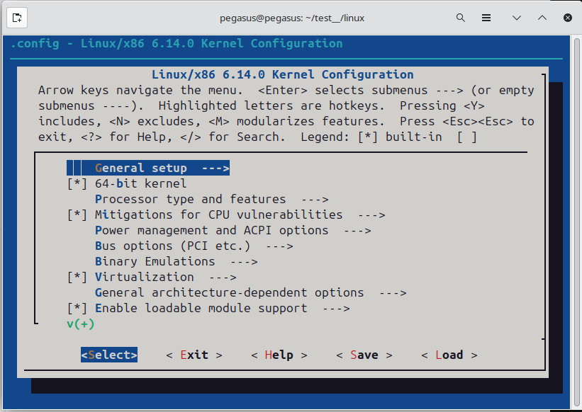
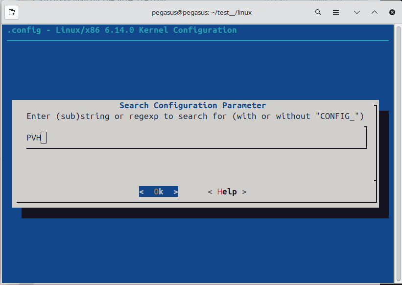
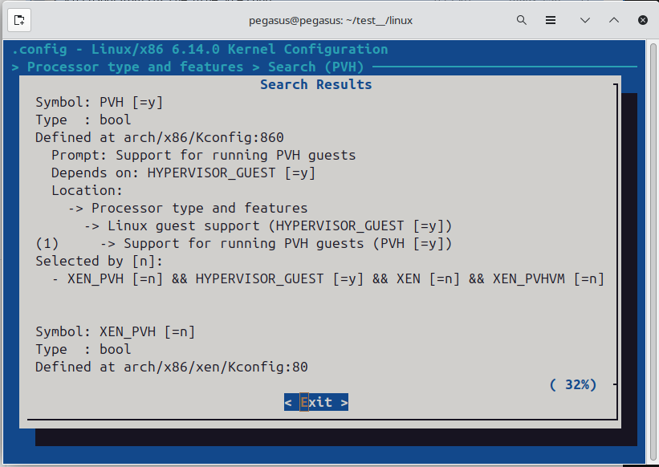
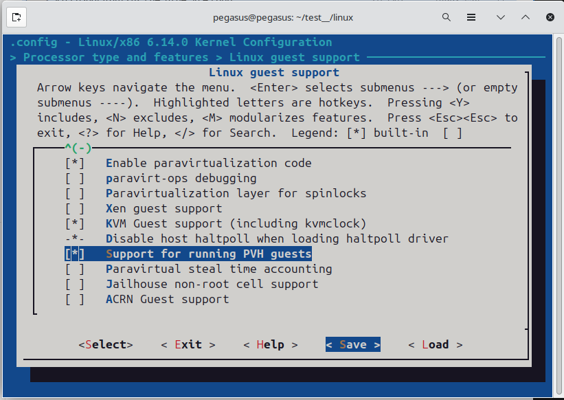
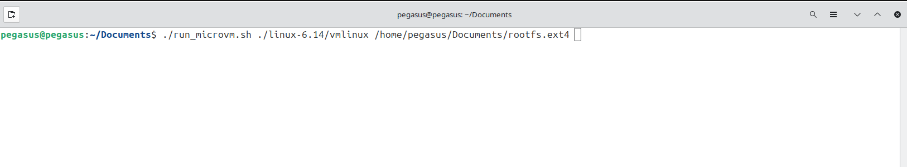
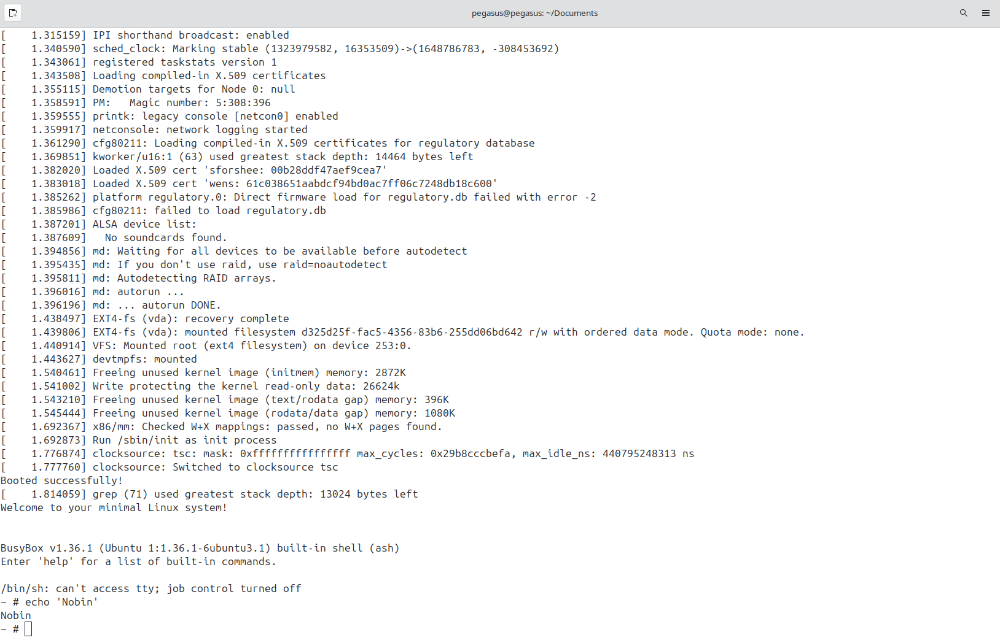
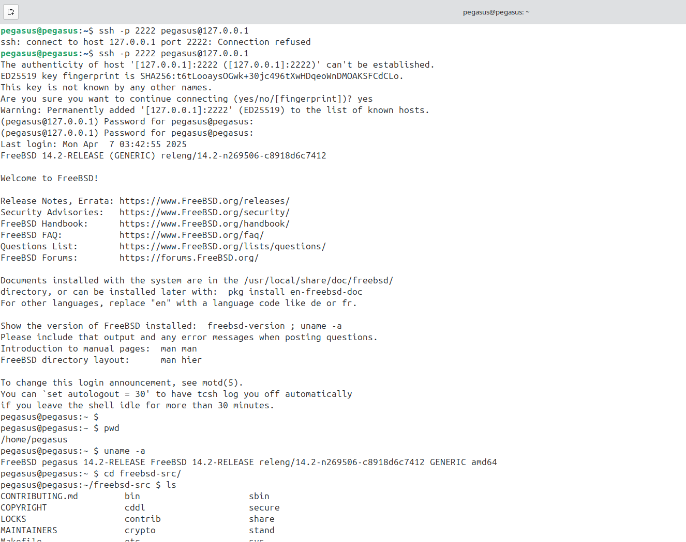
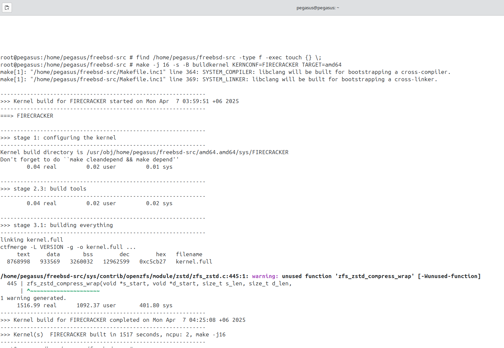

Recently I got started with FreeBSD kernel and came across this interesting article from [Tim Jones](https://adventurist.me/posts/00320). It mainly focuses on the author's effort to port the FreeBSD kernel to qemu microVM.

I'm step by step reproducing it. To reproduce it first I had to check if the qemu MicroVM was fully functioning or not.

First I cloned the linux kernel and compiled it, and got `vmlinux`. The qemu microVM needs uncompressed kernel image to run. Otherwise we could have used bzImage also. Then we created a basic ext4 filesystem.

Steps to create a vmlinux kernel image:
```
git clone https://git.kernel.org/pub/scm/linux/kernel/git/torvalds/linux.git 
cd linux
git checkout v6.14
make defconfig
make menuconfig
```


If you are new to menuconfig, use `/[keyword]`, to search a where a specific config lies. Press `Enter to enter into a nested setting. Then press `space/y` to enable that configuration. I forgot the exact key. Once a config is enabled you will see [*] around it's name. Then save the config. Be very careful about saving the config after enabling it. 










For our tesk turn this configs on:
```
Device Drivers → Character devices → Serial drivers → 8250/16550 (CONFIG_SERIAL_8250=y)

And Console on 8250/16550 (CONFIG_SERIAL_8250_CONSOLE=y)

Virtualization → KVM guest support (CONFIG_KVM_GUEST=y)

Device Drivers → Virtio drivers:

CONFIG_VIRTIO_BLK=y

CONFIG_VIRTIO_NET=y (if you eventually want networking)

CONFIG_VIRTIO_CONSOLE=y (if you switch from ttyS0 to virtio console)

CONFIG_EXT4_FS=y (for ext4 rootfs)

Processor type and features  --->
  [*] EFI stub support
  [*] Support for loading uncompressed kernel as a PVH guest

```

### Compile uncompressed kernel:
```
make -j$(nproc) vmlinux
```


Steps to create busy-box based rootfs
### 1. Get BusyBox Binary:
```
mkdir -p ~/rootfs/{bin,dev,proc,sys}
cd ~/rootfs

# Download the static 64-bit binary
wget https://busybox.net/downloads/binaries/1.35.0-x86_64-linux-musl/busybox

# Make it executable
chmod +x busybox

ln -s busybox bin/sh
ln -s busybox bin/ls
ln -s busybox bin/mount
ln -s busybox bin/cat
ln -s busybox bin/echo
```

### 1.Install BusyBox in a custom root directory:
```
cd ~/rootfs

# Copy in a static BusyBox binary (build or download one)
# Example: assume you have busybox in /usr/local/bin/busybox
cp /usr/local/bin/busybox ./busybox
chmod +x busybox

# Make standard directories
mkdir -p bin dev proc sys
ln -s busybox bin/sh
ln -s busybox bin/ls
ln -s busybox bin/mount
# ... link any other applets you need
```

### 2. Create an init script (so BusyBox has a basic init):
```
cat << 'EOF' > init
#!/bin/sh
mount -t proc none /proc
mount -t sysfs none /sys
echo "Welcome to BusyBox on QEMU microvm!"
exec /bin/sh
EOF

chmod +x init
```

### 3. Create an ext4 disk image
```
cd ~
dd if=/dev/zero of=rootfs.ext4 bs=1M count=64
mkfs.ext4 rootfs.ext4

mkdir mnt
sudo mount rootfs.ext4 mnt
sudo cp -r rootfs/* mnt/
sudo umount mnt
```

Booting into the linux kernel using qemu MicroVM.


Once this is done successfully you know that your qemu microVM is working fine.



Now that our qemu microVM is running, we got to compile the FreeBSD kernel and test it. Cross compiling on my host(ubuntu)  is a tedious job since the UNIX and FreeBSD are different. So I decided to switch to a freeBSD VM. I used virtualbox. You can get FreeBSD iso to boot from here:

`wget https://download.freebsd.org/ftp/releases/ISO-IMAGES/14.2/FreeBSD-14.2-RELEASE-amd64-disc1.iso` 

Then use that to boot to FreeBSD like any other iso image is used in virtualbox. If still having difficulites you can follow [this](https://www.google.com/url?sa=t&rct=j&q=&esrc=s&source=web&cd=&cad=rja&uact=8&ved=2ahUKEwicutOYiMyMAxVze2wGHTxJOVUQwqsBegQIFxAF&url=https%3A%2F%2Fwww.youtube.com%2Fwatch%3Fv%3DwGL3KiakMX8&usg=AOvVaw3vaIn949VEED-KHl0J6UiM&opi=89978449)


Once you booted into freeBSD VM.
Use `git clone https://git.freebsd.org/src.git freebsd-src` to get the kernel source. 

 


```
cd freebsd-src
find /home/pegasus/freebsd-src -type f -exec touch {} \;


```
I was having some issues with access time and modification time, that's why updated the file’s modification time and access time to the current time.


python -m http.server
```
or
```
python3 -m http.server
```

Then a python server will already be running on the directory, you wrote the command from.


Now let's find the local ip address assinged to the same pc where the server was spawned.
```
ipconfig
```
 

Put the IPv4 address on another PCs browser and also use the port. The default port for python http.server is `8000`.


Now just like any FTP server just navigate and click on the file you want to download.


### Using Network and Sharing
Do the following actions on both the PCs. Click on Network from file manager.


Go to firewall & network protection. On public network turn off the firewall. 


Go to `control pannel -> network and sharing center -> change advanced sharing settings`. Turn everything `on` except `Password protected sharing`.


Right click on the folder you want to share, press properties. Go to the sharing, press share.


Add `everyone` and give them `read/write` permissions. 


Go to Advanced sharing..., goto permissions, on everyone, tick allow on full control, change and apply it. 


From that image we can see the root directory name. Here it’s \\PEGASUS
Put this name on the path field in the file manager.
After pressing enter we found the shared folders.


Now select a specific folder that I want to share and right click on it. Click Map Network Drive…
Select a drive name. Tick connect using different credentials.


Press finish and set username and password, which will be later used from another pc to connected to this PC over the network.
Now from the other PC. Go to Networks, then on file paths put `\\PEGASUS`
Press enter. `More choices -> Use a different account`. Put the previously put username and password, press ok.


Voila! Now you are connected to your remote PC. Now you can see the shared folders from the different PC. Now you can copy the folder you want and paste it on your local directory.


### Using *robocopy* to copy folders/files
I created an empty folder where the files will be copied to. Turned sharing on in the previously mentioned way.


Command:<br/>
```
net use [mapped drive name] [the shared folder path] /user:[username] [password]
```
Use the username and password you previously set.<br/>Example:
```
net use K: \\SANZU\New /user:test test
```


Command:
```
robocopy [source directory] [target directory] [file to be copied] [options]
```

Example:
```
robocopy D:\sanzu K:\ sanzu.rar /mt /z /j
```


